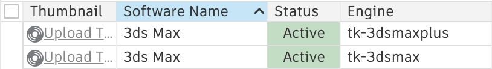

Migrating to the new ``tk-3dsmax`` engine
#########################################

You can easily update your existing Toolkit and ShotGrid configurations to use the new ``tk-3dsmax`` engine.

.. warning::
    The new ``tk-3dsmax`` engine supports **3ds Max 2017 and up**, while the existing ``tk-3dsmaxplus`` supports **3ds Max 2016-2020**. Do not attempt to migrate to the new ``tk-3dsmax`` engine if you still rely on **3ds Max 2016**. The new engine uses an API that did not exist in that version of 3ds Max.

Updating ShotGrid
=================

The new releases of ``tk-config-basic`` and ``tk-config-default2`` configurations, ``v1.3.0`` and up, include both 3ds Max engines. However, your ShotGrid site still needs to be updated to activate the ``tk-3dsmax`` engine.

In order for the new engine to be usable from the ShotGrid Desktop or the ``tank`` command, you need to make sure there is a ``Software`` entity in ShotGrid configured for the ``tk-3dsmax`` engine. To do this, visit the ``Software`` page on your ShotGrid site. If you are a ShotGrid administrator, you can access the page by clicking on the user icon at the top right of your site and selecting ``Software``. You can then create a second software entity named ``3ds Max`` with the ``Engine`` field set to ``tk-3dsmax``.

However, doing this means that both engines will now be active for the out of the box integrations. By using the ``Project`` field, you can restrict which project uses the ``tk-3dsmaxplus`` engine and which project uses the new ``tk-3dsmax`` engine in order to avoid disruption in production. If you are not using the out of the box ShotGrid Integrations and plan on having only one of the two engines in your Toolkit configuration, you can duplicate the ``3ds Max`` ``Software`` entity and update the ``Engine`` field without having to worry about assigning projects.

Updating the out of the box integrations
========================================

If you wish to use the new engine with a project, simply make sure that the project is using version ``v1.3.0`` or greater of ``tk-config-basic`` or ``tk-config-default2``. If you have updated your ShotGrid site by following the steps above , you are now ready to use 3ds Max with the new engine.

Migrating when using customized integrations
============================================

Migrating a configuration manually to use the ``tk-3dsmax`` engine is relatively straightforward. The following indicates which steps need to be taken to update your configuration.

A migration example
-------------------

You can view a pull request where ``tk-config-default2`` was updated to use the new engine `here <https://github.com/shotgunsoftware/tk-config-default2/pull/67>`__.

To learn more about each of the required changes, continue reading below.

Updating engine instance names
------------------------------

In order for the automatic software detection to work, you need to change the name of the ``tk-3dsmaxplus`` engine instances in your configuration to ``tk-3dsmax``.

For example:

.. code-block:: yaml

    engines:
      tk-3dsmax: "@settings.tk-3dsmax.project"

You'll also likely want to clean up file names and update references from ``tk-3dsmaxplus`` to ``tk-3dsmax``.

Updating the engine location
----------------------------

You need to update the ``location`` of the 3ds Max engine to point to the new engine named ``tk-3dsmax`` with a version of ``v1.0.0`` or greater.

For example:

.. code-block:: yaml

    tk-3dsmax:
        location:
            type: app_store
            name: tk-3dsmax
            version: v1.0.0

Updating the application hooks
------------------------------

Some of our applications originally shipped with the ``Blur Python`` version of the ``tk-3dsmax`` hooks. This will cause issues with the new engine as they share the same name. As such, you will need to update to newer versions of some of our applications so they do not include these outdated hooks.

- ``tk-multi-loader2`` version ``v1.19.5`` or greater
- ``tk-multi-snapshot`` version ``v0.7.5`` or greater
- ``tk-multi-workfiles2`` version ``v0.11.15`` or greater

If you do not update these applications, you will get an error similar to this one in your Toolkit logs:

.. code-block:: python

    Traceback (most recent call last):
      File "C:\Users\xxxxxx\install\core\python\tank\util\loader.py", line 55, in load_plugin
        module = imp.load_source(module_uid, plugin_file)
      File "C:\Users\xxxxxxx\bundle_cache\app_store\tk-multi-workfiles2\v0.11.14\hooks\scene_operation_tk-3dsmax.py", line 12, in <module>
        from Py3dsMax import mxs
    ImportError: No module named Py3dsMax

In addition, the 3ds Max hooks for those applications are now distributed with the engine instead of being distributed with the application. Therefore, you need to update the 3ds Max hooks for the following applications:

tk-multi-loader2
~~~~~~~~~~~~~~~~

You need to update ``actions_hook`` accordingly:

.. code-block:: yaml

    tk-multi-loader2:
        actions_hook: "{engine}/tk-multi-loader2/basic/scene_actions.py"

tk-multi-workfiles2
~~~~~~~~~~~~~~~~~~~

You need to update ``hook_scene_operation`` accordingly:

.. code-block:: yaml

    tk-multi-workfiles2:
        hook_scene_operation: "{engine}/tk-multi-workfiles2/basic/scene_operation.py"

tk-multi-snapshot
~~~~~~~~~~~~~~~~~

You need to update ``actions_hook`` accordingly:

.. code-block:: yaml

    tk-multi-snapshot:
        hook_scene_operation: "{engine}/tk-multi-snapshot/basic/scene_operation.py"

tk-multi-shotgunpanel
~~~~~~~~~~~~~~~~~~~~~

You need to update ``actions_hook`` accordingly:

.. code-block:: yaml

    tk-multi-shotgunpanel:
        actions_hook: "{engine}/tk-multi-shotgunpanel/basic/scene_actions.py"

tk-multi-publish2
~~~~~~~~~~~~~~~~~

There is no need to edit the hooks for the publisher. The default hook setting for the publisher searches for the hooks in the engine's ``hooks`` folder and this engine includes them at the expected location.

Updating your schema
--------------------

It is possible that your configuration uses the ``defer_creation`` parameter. Make sure that any references to ``tk-3dsmaxplus`` are converted to ``tk-3dsmax``.
